# Cognizant GenC / GenC Next Exam Preparation Guide

## Detailed Overview
- **Organiser**: Cognizant
- **Primary Category**: Corporate Employability Test
- **Difficulty Tier**: Beginner to Intermediate
- **Target Career Path**:
  - **GenC**: Programmer Analyst Trainee (₹4.0 LPA)
  - **GenC Pro**: Programmer Analyst (₹5.4 LPA)
  - **GenC Next**: Programmer Analyst (₹6.75 LPA)
- **Optimal Attempt Timeline**: Final year B.E. / B.Tech / Integrated M.Tech / MCA / M.Sc. IT
- **Brief Details**: Multi-tiered recruitment drive categorizing candidates based on assessment performance. Uses Superset for registration/screening, and HackerRank and SpeechX AI evaluation engines for testing.

---

## 1. 📚 SYLLABUS & ANALYSIS

The Cognizant evaluation evaluates candidates across distinct competency domains. Below is the granular breakdown of expected topics, sections, and structures.

### I. Communication Assessment (AI-Evaluated Versant/SpeechX | 60 Minutes)
Functions as an aggressive linguistic filter with an extremely high elimination rate (~40-45%). Evaluates fluency, pronunciation, vocabulary, and grammar.
- **Reading & Listening**: Reading complex sentences aloud with proper intonation; repeating dictated audio sentences verbatim; answering factual questions based on audio snippets; listening comprehension.
- **Speaking Tasks**: Storytelling (reconstructing a coherent narrative based on a sequence of images or an audio prompt); extempore speaking on a dynamically generated topic.
- **Grammar Mechanics**: Fill-in-the-blanks, sentence correction, subject-verb agreement, tenses, active/passive voice, and prepositions.

### II. Aptitude Assessment (80 Minutes | 30 Quant Qs + 4 Games)
Bifurcates into traditional commercial mathematics and modern psychometric game-based testing.
- **Quantitative Aptitude (30 Minutes | 30 Questions)**:
  - *Basic & Advanced Mathematics*: LCM & HCF, Divisibility rules, Fractions, Surds & Indices, Logarithms, Permutations and Combinations, Probability, Algebra, Geometry.
  - *Commercial & Word Problems*: Profit and Loss, Simple and Compound Interest, Percentages, Ratio & Proportion, Averages, Time/Speed/Distance, Time & Work, Pipes and Cisterns, Mixtures.
- **Game-Based Psychometrics (50 Minutes | 4 Games)**:
  - *Deductive-Logical (GeoStudio)*: Sudoku-like grid completions.
  - *Inductive-Logical (Spacio)*: Geometric transformation visual reasoning.
  - *Grid Challenge*: Multitasking and spatial memory tasks.
  - *Motion Challenge*: Shortest-path maze navigation.
  - *Switch Challenge*: Reverse-engineering pattern codes.
  - *Digit Challenge*: High-speed equation balancing.

### III. Technical Assessment (120 Minutes | Cluster-Based)
Candidates select one of three Skill Clusters during registration. **Cluster 1** is the default and statistically safest. An impressive 85% of the evaluation weight within this cluster rests on Java and ANSI SQL competencies.
- **Cluster 1: Java + Web UI + ANSI SQL**:
  - *Java Programming & OOPs*: Control Flow, OOP principles (Polymorphism, Inheritance, Encapsulation), Exception Handling, Collection Framework (Lists, Maps, Sets), String Handling, Multithreading, File I/O.
  - *Data Structures & Algorithms*: Arrays, LinkedLists, Stack/Queue, Search/Sort (Binary Search, Bubble, Quick, Merge), Graph algorithms (Dijkstra).
  - *Database Management (ANSI SQL)*: DDL/DML/DCL/TCL commands, Joins (Inner, Outer, Left, Right), Sub-queries, Views, Indexes, PL/SQL, Stored Procedures, Triggers, Cursors.
  - *Web UI & Cloud*: HTML semantic structures, CSS box model/layout (flexbox/grid), JavaScript DOM manipulation, Cloud fundamentals (IaaS, PaaS, SaaS).
- **Cluster 2: Python + ANSI SQL + Cloud Fundamentals**
- **Cluster 3: C# + ANSI SQL + Web UI**
- **Advanced Programming Pattern (For Specialized Off-Campus GenC Next Drives)**:
  - 2 Easy Coding questions (50 mins)
  - 20 Debugging questions (20 mins)
  - 2 Hard Coding questions (50 mins)

---

## 2. 📝 EXAM PATTERN & PLATFORM MECHANICS

- **Platform Hosts**: Superset (registration & tracking), HackerRank (coding/SQL), SpeechX (voice communication).
- **Non-Adaptive Design**: Questions are predetermined; difficulty does not scale dynamically based on correctness.
- **No Negative Marking**: All questions must be attempted to maximize points.
- **Sequential Funnel**: Failure to clear the sectional cutoff in one round results in immediate elimination.
- **Cascading Safety Net**: If a candidate marginally misses the GenC Next threshold, they are automatically re-evaluated for the GenC Pro tier, and subsequently the standard GenC profile.

---

## 3. 🎓 ELIGIBILITY CRITERIA

Cognizant enforces strict, automated screening filters on the Superset platform.

| Parameter | Eligibility Requirement | Additional Constraints |
| :--- | :--- | :--- |
| **Academic Percentage** | Minimum 60% (or 6.0 CGPA) | Across 10th, 12th, Diploma, UG, and PG. Strict. No rounding (e.g., 59.9% is disqualified). Some drives require 70% for Pro/Next. |
| **Active Backlogs** | 0 active backlogs / standing arrears | Must be cleared within course duration. Must present provisional degree at onboarding. |
| **Education Gaps** | Maximum 2 years cumulative | Gaps between studies are allowed, but no gaps allowed *during* the B.Tech course. |
| **Age Limit** | Minimum 18 years; Maximum 30 years | Checked against official documents. |
| **Eligible Degrees** | Full-time B.E./B.Tech, M.E./M.Tech, MCA, M.Sc. IT | Correspondence/distance learning programs are ineligible. |
| **Branch Restrictions** | Preference for CSE, IT, ECE | Excludes Leather, Food, and Fashion Technology. Non-CS graduates are tested on CS standards. |
| **Identity Consistency** | Matches perfectly across records | Full name and DOB must match on 10th marksheet, Superset profile, and PAN card. |

---

## 4. 🎯 RECOMMENDED SCORES / TARGET PERCENTILES

To secure the premium GenC Next profile, unreserved/General Category candidates must target the apex of the performance distribution:

| Assessment Component | General Category Target Metric for GenC Next | Performance Impact |
| :--- | :--- | :--- |
| **Overall Percentile** | **>95th Percentile** | Required to absorb high demographic competition. |
| **Communication Round** | **>80% Accuracy** | Pass/fail threshold. |
| **Quantitative Aptitude** | **25+ Correct out of 30** | Crucial baseline filter. |
| **Game-Based Aptitude** | **Level 9 to 10 across all games** | Measures processing velocity and error rates. |
| **Technical Assessment** | **100% Code & SQL Execution** | Both coding questions, both SQL queries, and the Web UI scenario must execute perfectly against hidden test cases. |

---

## 5. 🌐 BEST FREE RESOURCES

### YouTube Channels
- **Hiring Guru Official**: Exhaustive SpeechX AI and Versant communication masterclasses, cheat codes, and test simulations.
- **OnlineStudy4u**: High-fidelity walkthroughs of Game-Based Aptitude challenges (Grid, Switch, Spacio, etc.).
- **PrepInsta / PrepInsta Prime**: Real-time coding and SQL preparation, syllabus deep dives, and previous years' questions (PYQs).
- **Prime Coding**: Focuses on post-interview experiences, interview preparation, and Next/Pro cutoffs.
- **The Humble Coder**: Great for high-speed Quant preparation and communication walkthroughs.

### Web Platforms
- **PrepInsta.com**: Free repository of the "Top 100 Coding Questions", SQL practice dashboards, and mock test interfaces.
- **GeeksforGeeks.org**: Vast collection of Cognizant SDE Sheets, DBMS/OOPs theory, and actual candidate Interview Experiences.
- **PlacementPreparation.io**: Up-to-date tracker for eligibility, off-campus phase dates, and exam patterns.
- **HackerRank & LeetCode**: Familiarize yourself with the HackerRank test environment (STDIN/STDOUT). Solve LeetCode easy-to-medium string/array tasks.

### GitHub Repositories
- [SAKET-SK/Programming-Aptitude-Interview-Prep](https://github.com/SAKET-SK/Programming-Aptitude-Interview-Prep): Compilation of programming aptitude questions, logic-building snippets, and PYQs.
- [sajidali351/Cognizant-GenC-Learn](https://github.com/sajidali351/Cognizant-GenC-Learn): Mapped to Cluster 1 Java. Contains implementations of Spring Boot, MVC, Maven, and Unit Testing for technical interviews.

### Scribd Documents
- **Cognizant SpeechX Assessment & Communication PDFs**: Versant rubrics, dictation tasks, and story prompt templates.
- **GenC Interview Guide Updated**: Summarized guides for OOPs, Web Development, and SQL.
- **Cognizant GenC 2025 Sample Coding Questions**: Tiered programming problems (basic logic to advanced DSA like Kadane's, LRU Cache).

---

## 6. 💡 TOP 5 STRATEGIES FOR SUCCESS

1. **Calibrate for the SpeechX AI**: Speak deliberately (10-15% slower than usual), use a wired noise-canceling headset, and prioritize simple grammar over vocabulary. The AI NLP engine rewards grammatical structure, not creativity.
2. **Prioritize SQL Joins and Database Logic**: SQL is the ultimate score differentiator. Solving both SQL queries and one coding problem yields a higher percentile weight than solving two coding problems and leaving SQL blank.
3. **Internalize Game Puzzles beforehand**: Watch gameplay walkthroughs of the *Switch Challenge* and *Grid Challenge*. Reaching Level 9/10 requires speed; knowing the interface beforehand saves critical seconds.
4. **Optimize Coding for Hidden Cases**: Avoid naive $O(N^2)$ solutions. Default to HashMaps ($O(N)$), Binary Search ($O(\log N)$), or Two-Pointer techniques. Hidden edge cases with large constraints will trigger Time Limit Exceeded (TLE) errors.
5. **Default to the Java Skill Cluster**: Cluster 1 (Java + Web + SQL) is the most predictable. Materials are plentiful, and interviewers are highly calibrated to ask about core Java OOPs, Collection frameworks, and garbage collection.

---

## ⚠️ COMMON MISTAKES TO AVOID

- **Assuming Decimal Rounding is Allowed**: Cognizant's Superset screening tools truncate decimals. A 59.9% or 59.95% aggregate is automatically disqualified.
- **Skipping the Web UI (HTML/CSS/JS) Scenario**: Ambitious programmers often ignore the web interface task. Doing so severely damages the holistic weighted score and eliminates you from the GenC Next cohort.
- **Name Mismatches in Official Documents**: Ensure the name and date of birth match perfectly on your 10th marksheet, Superset profile, and PAN card. Any mismatch triggers automated rejection at background verification.
- **Fumbling on Fundamental OOPs/Java Concepts**: Interviewers value clear explanations of basic structures (e.g., Difference between List and Set, 4 pillars of OOPs with real-world analogies) over complex design structures.
- **Neglecting Aptitude for Competitive Coding**: If you fail to pass the Quantitative or Game-based aptitude sectional cutoffs, you will be disqualified before the technical coding round even unlocks.

---

## ⏳ COMPREHENSIVE 4-MONTH PREPARATION TIMELINE

```mermaid
gantt
    title Cognizant GenC / GenC Next 4-Month Preparation Roadmap
    dateFormat  X
    axisFormat %d
    section Month 1
    Language Syntax & OOPs (Java)      :active, 0, 15
    Database Mastery & ANSI SQL        :active, 15, 30
    section Month 2
    Data Structures & Algorithms (DSA) : 30, 45
    Web UI & Cloud Foundations         : 45, 60
    section Month 3
    Quantitative Aptitude              : 60, 75
    Game-Based Cognitive Conditioning  : 75, 90
    section Month 4
    SpeechX AI Vocal Calibration       : 90, 105
    Full-Length Mock Gauntlets         : 105, 120
```

### Month 1: Foundational Architecture & Database Mastery
- **Weeks 1–2 (Java Foundations)**: Master control flows, nested loops, OOP principles (Inheritance, Polymorphism), Collection frameworks (Lists, Sets, Maps), and Exception handling.
- **Weeks 3–4 (ANSI SQL)**: Focus on complex JOIN operations, sub-queries, GROUP BY, HAVING, PL/SQL, Triggers, and Stored Procedures.

### Month 2: Advanced Tech & Web UI Integration
- **Weeks 5–6 (DSA)**: Practice binary search, sorting (Quick/Merge), string manipulation, and two-pointer traversals on arrays/strings.
- **Weeks 7–8 (Web UI & Cloud)**: Master HTML semantic structure, CSS layout (flexbox/grid), and JavaScript DOM manipulation. Review Cloud service models (IaaS, PaaS, SaaS).

### Month 3: Cognitive Agility & Psychometrics
- **Weeks 9–10 (Quantitative Aptitude)**: Practice commercial math (P&L, SI/CI, Time/Speed/Distance, Time & Work) under timed conditions. Learn calculation shortcuts.
- **Weeks 11–12 (Game Puzzles)**: Watch walkthroughs of game challenges. Practice spatial reasoning and memory tasks to perform optimally under stress.

### Month 4: AI Communication & Mock Simulations
- **Weeks 13–14 (AI Communication)**: Practice reading aloud and storytelling. Speak clearly at a measured pace. Record audio and check for regional accents or fillers.
- **Weeks 15–16 (Mock Gauntlets)**: Replicate the 260-minute test environment. Practice timed mixed-bag assessments on HackerRank and PrepInsta.

---

## 🤝 POST-ASSESSMENT SELECTION PROCESS

Successful candidates clearing the technical rounds proceed to:
1. **Technical & HR Interview**: Conducted as a single combined round (30-45 mins). Expect live coding, questions on OOPs basics, Java Collections details, database queries, and background/academic verification.
2. **Onboarding & Verification**: Highly strict document check. Any name discrepancy across Aadhaar, PAN, and school marksheets will result in offer revocation.
