# Wipro Elite NLTH (National Talent Hunt) Exam Preparation Guide

## Detailed Overview
- **Organiser**: Wipro
- **Primary Category**: Corporate Employability Test
- **Difficulty Tier**: Beginner
- **Target Career Path**: Project Engineer (₹3.5–4.5 LPA) / Turbo Engineer (₹8.0–10.0 LPA)
- **Optimal Attempt Timeline**: Final year B.E. / B.Tech / Integrated M.Tech / MCA / M.Sc.
- **Brief Details**: Elite National Talent Hunt; aptitude + essay writing + coding; administered on the adaptive AMCAT platform.

---

## 1. 📚 SYLLABUS & ANALYSIS

The Wipro NLTH evaluates candidates across five distinct domains. Below is the granular breakdown of expected topics, questions, and average timing constraints.

### I. Quantitative Aptitude (16 Questions | 16 Minutes)
Evaluates numerical agility. Reliance on manual multi-step calculations is a major trap; candidates should use shortcuts and mental math.

| Topic Cluster | Core Sub-Topics Tested | Expected Questions | Target Time per Item |
| :--- | :--- | :--- | :--- |
| **Basic Mathematics** | LCM & HCF, Divisibility Rules, Decimals, Fractions, Power Indices | 2 – 4 | 45 – 60 sec |
| **Commercial Math** | Profit & Loss, Simple/Compound Interest, Percentages, Averages | 2 – 4 | 50 – 55 sec |
| **Applied Mathematics** | Time/Speed/Distance, Pipes & Cisterns, Train Crossings, Work Efficiency | 2 – 6 | 40 – 50 sec |
| **Advanced/Engineering**| Logarithms, Permutations & Combinations, Probability Expectation | 2 – 5 | 30 – 55 sec |
| **Geometry & Algebra** | Mensuration (2D/3D), Coordinate Geometry, Algebraic Equations, Surds | 2 – 5 | 50 – 60 sec |

### II. Logical Ability (14 Questions | 14 Minutes)
Designed to induce cognitive fatigue via complex text constraints.
* **Deductive Reasoning**: Syllogisms, Statement & Conclusion, Inference Derivation.
* **Relational Logic**: Blood Relations (family tree mapping), Directional Sense Tests.
* **Pattern Recognition**: Coding-Decoding, Number Series, Visual Analogy, Missing Characters.
* **Arrangements**: Seating arrangements, Decision Selection Tables, Data Sufficiency (do not solve the math, just check if enough data is provided).

### III. Verbal Ability (22 Questions | 18 Minutes)
Tests applied grammar and syntax. Average of less than 50 seconds per item.
* **Vocabulary Mechanics**: Synonyms, Antonyms, Contextual Vocabulary Replacement, Spelling.
* **Applied Grammar**: Subject-Verb Agreement, Error Identification, Prepositions, Conjunctions.
* **Syntactic Construction**: Active/Passive Voice conversions, Direct/Indirect Speech transitions.
* **Comprehension**: Short inferential reading comprehension paragraphs.

### IV. Written Communication / WriteX (1 Essay | 20 Minutes)
Evaluated automatically using SHL's **WriteX** NLP engine. Key evaluation vectors:
* **Mechanical Accuracy**: Grammatical errors, punctuation, and typos heavily penalize scores.
* **Structure & Connectives**: Use a 4-paragraph format and discourse connectors (*Furthermore*, *Consequently*, *On the contrary*, *In summation*).
* **Word Limit**: Strictly adhere to the requested length (typically 200–250 words or 300–400 words).
* **Common Themes**: Ambition vs personal life, climate change, traditional vs modern agriculture, Unity in Diversity, euthanasia, smart cities vs smart laws, social media.

### V. Online Programming / Automata (2 Questions | 60 Minutes)
Tests coding implementation using C, C++, Java, or Python.
* **Easy-Medium (Q1)**: String parsing (vowel extraction, palindromes), 1D array traversals, basic mathematical logic.
* **Medium-Hard (Q2)**: Multi-dimensional arrays (matrices), basic Data Structures (stacks, queues, linked lists), trapezoidal pattern printing.
* **Common Archetypes**: eBay Shipping Calculator, Digit Sum Difference, Employee Distance Range Filtering, Dual-Function Array Sorting.

---

## 2. 📝 EXAM PATTERN & PLATFORM MECHANICS

The assessment is administered on the **AMCAT (Aspiring Minds Computer Adaptive Test)** platform.

* **Computer-Adaptive Architecture**: The difficulty of each question calibrates dynamically based on the correctness of your previous answer. Questions answered correctly raise the difficulty (and scoring weight). 
* **Strict Navigation Policy**: The platform enforces **absolute forward-only progression**. There is zero intra-sectional or inter-sectional navigation. You cannot go back or skip a question.
* **Sectional Time Isolation**: The exam is strictly siloed. You cannot save time from one section to spend on another.
* **Webcam Proctoring**: Visual algorithms track eye movement, facial orientation, and ambient noise. Accumulating proctoring flags leads to automated termination.

---

## 3. 🎓 ELIGIBILITY CRITERIA

Wipro enforces strict academic and temporal filters that cannot be bypassed.

| Parameter | Eligibility Requirement | Additional Constraints |
| :--- | :--- | :--- |
| **10th Standard** | Minimum 60% aggregate | No rounding up permitted. |
| **12th Standard / Diploma** | Minimum 60% aggregate | Full-time regular courses only. |
| **Graduation (B.Tech)** | Minimum 60% or 6.0 CGPA | Calculated based on university conversion factor. |
| **Degree Formats** | B.E. / B.Tech / Integrated M.Tech | Full-time degree only; correspondence degrees are ineligible. |
| **Excluded Branches** | Fashion Tech, Textile, Agriculture, Food Tech | Candidates from these domains are ineligible. |
| **Age Limit** | Maximum 25 years | Hard ceiling for General Category applicants. |
| **Education Gaps** | Maximum 3 years | Permissible only between 10th and graduation. 0 gaps allowed during B.Tech. |
| **Backlogs** | Max 1 active backlog | Must be cleared before final onboarding. |
| **Cooling-Off Period** | 6 Months | Minimum gap required between two Wipro applications. |

---

## 🎯 RECOMMENDED SCORES / TARGET PERCENTILES

Since the AMCAT evaluates comparative percentiles rather than absolute marks, candidates must target sectional safety margins:

| Section | Passing Cutoff | Target Safe Percentile (Gen Category) | Priority Weight |
| :--- | :--- | :--- | :--- |
| **Quantitative Aptitude** | 70th Percentile | **75th - 80th Percentile** | High |
| **Logical Ability** | 70th Percentile | **75th - 80th Percentile** | High |
| **Verbal Ability** | 75th Percentile | **80th - 85th Percentile** | High |
| **Written Communication** | 80th Percentile | **85th - 90th Percentile** | Critical |
| **Automata Coding** | 80th Percentile | **85th+ Percentile** (1.5+ Questions Solved) | Paramount |

---

## 🌐 BEST FREE RESOURCES

### GitHub Repositories
* [rutuja1302/WIPRO-NLTH](https://github.com/rutuja1302/WIPRO-NLTH): Exact code solutions to previous Wipro-specific coding problems (e.g. *OilFactory*, *Beautify Me*).
* [SAKET-SK/Programming-Aptitude-Interview-Prep](https://github.com/SAKET-SK/Programming-Aptitude-Interview-Prep): Sorting/searching cheatsheets, OOP guides, and interview logs.
* [Cyberster/Wipro-Training-Day-6](https://github.com/Cyberster/Wipro-Training-Day-6): Java implementations for standard numerical parsing tasks.

### Competitive Coding Practice
* [CodeChef Wipro Elite NTH Path](https://www.codechef.com/practice/wipro-elite-nth): ~100 curated coding questions simulating the time constraints of the Automata compiler.

### Reference Websites & Channels
* **PrepInsta**: Detailed WriteX and Automata guides, grammar patterns, and question templates.
* **YouTube**: *PrepInsta Prime*, *TalentBattle*, *OnlineStudy4U*, and *Hiring Guru Official* (for WriteX/proctoring guidelines).

---

## 💡 TOP 5 STRATEGIES FOR SUCCESS

1. **Leverage the "Early Weighting" Adaptive Principle**: The first 5 to 7 questions in each cognitive section carry disproportionate weight under Item Response Theory. Ensure absolute accuracy on these to force the engine to serve high-value questions.
2. **Practice Ruthless Triage**: Since navigation is forward-only, decide within the first 15 seconds of reading a math/logical item whether to solve or make an educated guess and proceed. Do not waste minutes on a single item.
3. **Write for the Machine (WriteX)**: Do not try to impress the essay AI with complex metaphors. Keep sentences short, active, and grammatically perfect. Use transition words (*Furthermore*, *Consequently*, *On the contrary*) to maximize the organization score.
4. **Optimize Coding for Edge Cases and Complexity**: Automata executes hidden test cases up to $N = 10^5$. Naive $O(N^2)$ solutions will trigger a Time Limit Exceeded (TLE) error. Optimize to $O(N)$ or $O(N \log N)$ using two-pointers or HashMaps. Always test for null, empty, zero, and negative inputs.
5. **Replicate Exam Proctoring in Mock Practice**: Take full 128-minute mock tests without a calculator, without backward navigation, and maintain a fixed posture directly in front of the screen.

---

## ⚠️ COMMON MISTAKES TO AVOID

* **Violating WriteX Word Counts**: Exceeding or falling short of word count limits results in instant, severe automated score penalties.
* **Calculator Dependency**: Calculators are strictly prohibited during the exam. Perform all practice math manually.
* **The Data Sufficiency Trap**: In logical sections, do not spend time calculating the exact values in Data Sufficiency questions. Just determine if the statements are theoretically sufficient.
* **Ignoring Coding Basics**: Candidates often practice advanced DSA (graphs, DP) while ignoring matrix transpositions, 1D array manipulations, and string filtering, which represent 95% of Wipro's coding tests.
* **The "Skip and Return" Fallacy**: Forgetting that the "Next" button is permanent leads to panic during the live test. Commit to your answers.

---

## ⏳ COMPREHENSIVE 4-MONTH PREPARATION TIMELINE

```mermaid
gantt
    title Wipro NLTH 4-Month Preparation Roadmap
    dateFormat  X
    axisFormat %d
    section Month 1
    Language & Aptitude Fundamentals : active, 0, 30
    section Month 2
    Algorithmic Practice & WriteX    : 30, 60
    section Month 3
    Time Complexity & Section Mixers : 60, 90
    section Month 4
    Full Mock Simulation & Review    : 90, 120
```

### Month 1: Foundational Architecture & Language Mastery
* **Programming**: Select C++, Java, or Python. Master standard library utilities, loops, array initialization, and standard I/O streams. Practice coding on a plain text editor without IDE autocompletions.
* **Quant & Logical**: Memorize tables up to 25, squares up to 30, and cubes up to 15. Learn fractional values (e.g., $1/6 = 16.67\%$, $1/7 = 14.28\%$). Master basic Syllogisms.
* **Verbal**: Read technical/editorial columns daily to improve structural vocabulary.

### Month 2: Topic Mastery & Writing Setup
* **Programming**: Transition to CodeChef's Wipro practice path. Solve 1D/2D array questions, basic sorting, and string reversals.
* **Quant & Logical**: Focus on Time & Work, Speed & Distance, Probability, and Seating Arrangements. Use a stopwatch to limit logical questions to 60 seconds.
* **WriteX**: Write one 250-word essay every three days based on past prompts. Validate with spelling/grammar checkers.

### Month 3: Optimization & Dynamic Practice
* **Programming**: Focus on reducing complexity from $O(N^2)$ to $O(N)$ or $O(N \log N)$. Practice manual edge-case verification.
* **Quant & Logical**: Shift from topic-wise practice to random mixed-bag tests. Train your brain to handle rapid context-switching.
* **Verbal**: Focus on Active/Passive, Direct/Indirect, and Prepositions.

### Month 4: Platform Simulation & Final Polish
* **Mocks**: Take full-length, proctored 128-minute mock tests twice a week. Disable all calculators and tabs.
* **Analysis**: Perform a detailed post-mortem on mock tests to identify time-sinks, compilation failures, and grammatical errors.
* **Rest & Review**: In the final week, stop learning new topics. Review cheat sheets, memorize syntax declarations, and rest your mind.

---

## 🤝 POST-ASSESSMENT SELECTION PROCESS

Successful candidates who clear all sectional percentiles proceed to the interviews:

1. **Technical Interview**: Focuses on OOPs principles, basic Database Management Systems (DBMS) queries, Operating System concepts, and the code logic/complexity used during the Automata round.
2. **HR Interview**: Evaluates communication skills, adaptability, cultural fit, and candidate willingness to relocate.
3. **Service Agreement**: Joining is contingent on accepting a 12 to 15-month service bond with a pro-rata penalty of ₹75,000 for early departure.
